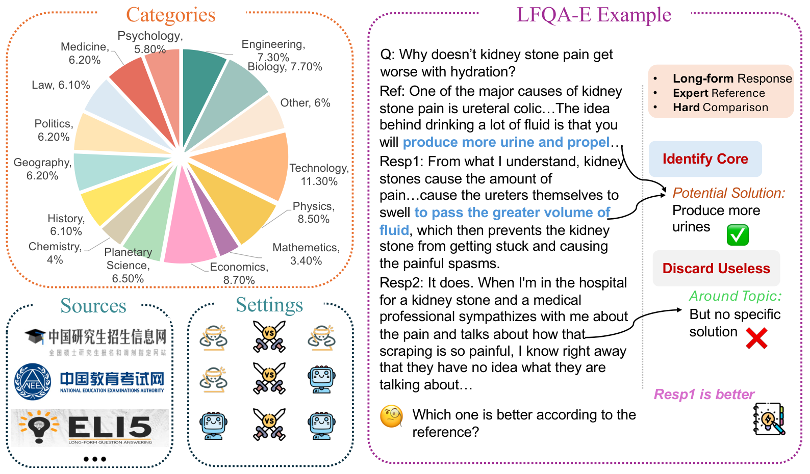

# LFQA-E: Carefully Benchmarking Long-Form QA Evaluation

<p align="center">
  <a href="https://openreview.net/forum?id=XXXXX"></a>
  <a href="https://github.com/YuchenFan48/LFQA-E"></a>
  <a href="LICENSE"></a>
</p>

## 📖 Overview

**LFQA-E** is a well-constructed, multilingual, and reference-based benchmark designed to rigorously evaluate automatic metrics for Long-Form Question Answering (LFQA). 

Long-Form Question Answering involves generating comprehensive, paragraph-level responses to open-ended questions, which poses a significant challenge for evaluation due to the richness of information and flexible response format.

<p align="center">
  
</p>

## 📊 Benchmark Statistics

| Statistic | LFQA-E-EN | LFQA-E-ZH | Total |
|-----------|-----------|-----------|-------|
| **Topics** | 9 | 6 | 15 |
| **Questions** | 1,026 | 592 | 1,618 |
| **Comparisons** | 6,130 | 1,193 | 7,323 |
| **Avg Question Length** | 13.4 | 24.6 | - |
| **Avg Reference Length** | 299.1 | 187.2 | - |
| **Avg Response Length** | 245.0 | 308.3 | - |

### Topic Distribution

LFQA-E spans **15 diverse topics** including:
- **Natural Sciences**: Engineering, Biology, Physics, Chemistry, Mathematics, Planetary Science
- **Social Sciences**: Economics, History, Geography, Politics, Law, Psychology
- **Applied Fields**: Technology, Medicine
- **Other**: General knowledge

### Comparison Settings

LFQA-E includes three types of comparisons to enable comprehensive evaluation:

| Setting | Description |
|---------|-------------|
| **Human vs Human** | Compare two human-written responses |
| **Human vs Model** | Compare human-written vs model-generated responses |
| **Model vs Model** | Compare two model-generated responses |

## 🗂️ Data Format

Each record in the benchmark contains the following fields:

```json
{
  "id": "unique-uuid",
  "question": "The question text",
  "context": "Additional context if available",
  "type": "Topic category (English only)",
  "reference": "Expert-annotated reference answer",
  "response_a": "First response to compare",
  "response_b": "Second response to compare",
  "compare_type": "human_vs_human | human_vs_model | model_vs_model",
  "label": "response_a | response_b | same"
}
```

## 📁 Files

| File | Description |
|------|-------------|
| `unified_benchmark.json` | Complete benchmark (7,323 records) |
| `unified_benchmark_zh.json` | Chinese subset (1,193 records) |
| `unified_benchmark_en.json` | English subset (6,130 records) |

## 🔬 Key Features

1. **Reference-Based Evaluation**: All questions come with expert-annotated reference answers, providing a baseline for fair comparison.

2. **Difficult Comparisons**: Responses are carefully selected to be hard to differentiate:
   - Human responses with close scores/upvotes
   - Model responses from LLMs with comparable capabilities

3. **Multilingual Support**: Includes both Chinese and English data from diverse sources:
   - **Chinese**: College Entrance Examination Simulation Questions (CEESQ) and Postgraduate Entrance Examination Questions (PEEQ)
   - **English**: Reddit/ELI5 forum questions

4. **Expert Annotation**: All data annotated by domain experts with substantial inter-annotator agreement 


## 📈 Benchmark Results

We evaluated 17 automatic evaluation metrics across 5 categories:

| Category | Example Metrics |
|----------|----------------|
| Static Metrics | Length, ROUGE, BERTScore |
| LLM-based | GPT-4o, Qwen2.5, DeepSeek-V3 |
| LRM-based | o1-mini, DeepSeek-R1 |
| RM-based | Skywork-Reward, RM-R1 |
| Trained Models | Auto-J, Prometheus |

**Key Finding**: None of the existing automatic metrics perform comparably to human judgments, highlighting the challenge of evaluating long-form responses.

## 🚀 Usage

### Loading the Data

```python
import json

# Load the complete benchmark
with open('unified_benchmark.json', 'r', encoding='utf-8') as f:
    data = json.load(f)

# Load language-specific subsets
with open('unified_benchmark_zh.json', 'r', encoding='utf-8') as f:
    zh_data = json.load(f)

with open('unified_benchmark_en.json', 'r', encoding='utf-8') as f:
    en_data = json.load(f)
```

### Evaluating Your Metric

```python
def evaluate_metric(metric_fn, data):
    correct = 0
    total = len(data)
    
    for record in data:
        prediction = metric_fn(
            question=record['question'],
            reference=record['reference'],
            response_a=record['response_a'],
            response_b=record['response_b']
        )
        if prediction == record['label']:
            correct += 1
    
    return correct / total

accuracy = evaluate_metric(your_metric, data)
print(f"Accuracy: {accuracy:.2%}")
```

<!-- ## 📝 Citation

If you find LFQA-E useful in your research, please cite our paper:

```bibtex
@inproceedings{fan2026lfqae,
  title={LFQA-E: Carefully Benchmarking Long-Form QA Evaluation},
  author={Fan, Yuchen and Ling, Chen and Zhong, Xin and Zhang, Shuo and Zhou, Heng and Zhang, Yuchen and Liang, Mingyu and Xie, Chengxing and Hua, Ermo and Huang, Chen and He, Zhizhou and Huang, Cheng and Ding, Ning and Zhou, Bowen},
  booktitle={International Conference on Learning Representations (ICLR)},
  year={2026}
}
``` -->

## 📧 Contact

For questions or issues, please contact:
- Yuchen Fan: yuchenfan48@gmail.com

## 📜 License

This project is licensed under the MIT License - see the [LICENSE](LICENSE) file for details.

## 🙏 Acknowledgments

We thank all the annotators and domain experts who contributed to the construction of LFQA-E.